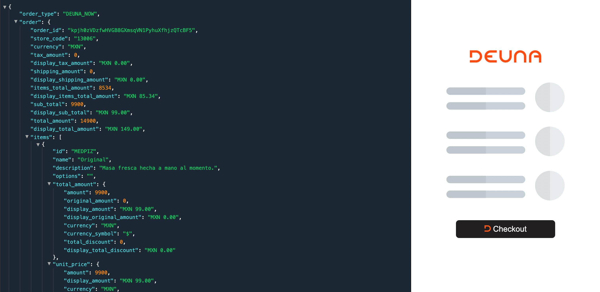
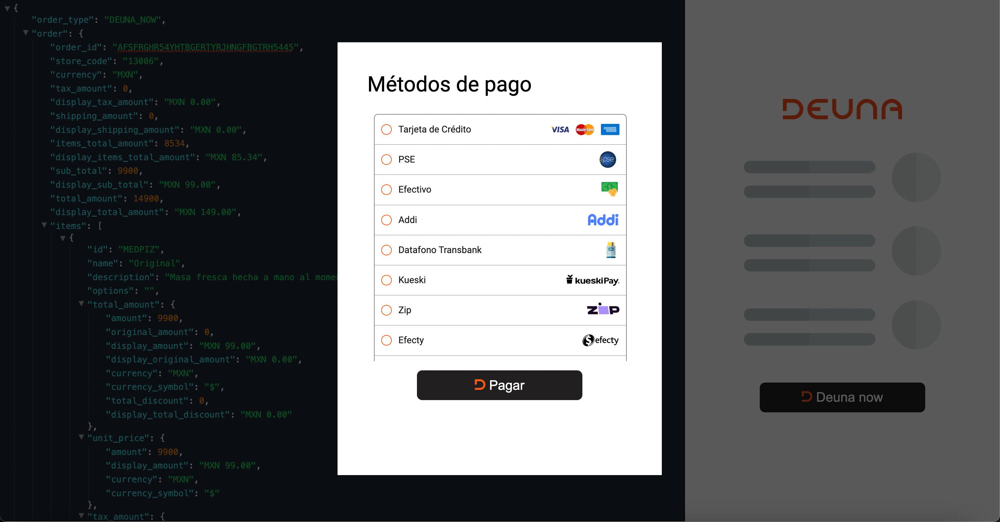

<br />
<p align="center">
  <a href="https://deuna.com/">
    
  </a>
</p>

<h2 align="center">Deuna Now</h2>
<p align="center">Disponibiliza un abanico creciente de métodos de pago (tarjetas, BNPL, etc.) para ofrecer la máxima flexibilidad de pagos. Interactua con el UI del merchant.</p>
<br />
<p align="center">
Este repositorio es solamente para nuestra  <a href="https://docs.deuna.com/" style="color: #f50;">documentación</a>.👌
</p>
<br />

# Deuna Now vanillaJS

## Descripción:
la App de vanillaJS se encargada de tokenizar la orden, configurar el payment-widget, renderizar el payment widget y procesar el pago.


Los siguientes procesos se realizan en el frontend:
| Procesos| Frontend |  |
| --- | --- | --- |
| Tokenizar la orden |  ✅  |  |
| Inicializar widget-payment |  ✅  |  |
| Procesar el pago |  ✅  |  |

# Requisitos para documentación
Se requiere lo siguiente si estas revisando documentación y plantillas de prueba para la integración con deuna now:

* jsonEditor
* [Jquery](https://jquery.com/) =3.3.1

# Estructura del proyecto


```
project
│___README.md
│
deuna-now
    └───deuna-now-js
        └───dist           # recursos para ejecutar el proyecto
        └───images
        └───index.html     # archivo a ejecutar
        └───config.js      # archivo de cofiguración
```

# Implementar Deuna Now con vanillaJS

## Requerimientos

- Api key

## Como ejecutar

1. Obten tu llave privada [Documentación](https://docs.deuna.com/docs/api-key)
2. Agrega la variable `DEUNA_PUBLIC_API_KEY` en el archivo config.js 
3. Agrega la variable `ENVIRONMENT` al archivo config.js 
4. Abrir el archivo `index.html` en el navegador

Asegurate de configurar estas variables en `config.js` que se  encuentra en la raiz del proyecto. Debería incluir las siguientes variables:

```yaml
# DEUNA API keys - see https://docs.deuna.com/docs/api-key
DEUNA_PUBLIC_API_KEY=""00cdd7f62063c..."
ENVIRONMENT= "Staging..."
```

## Ejemplo que se ve en el navegador

<br />
<p align="center">
  <a href="https://deuna.com/">
    
  </a>
</p>

<p align="center">
  <a href="https://deuna.com/">
    
  </a>
</p>